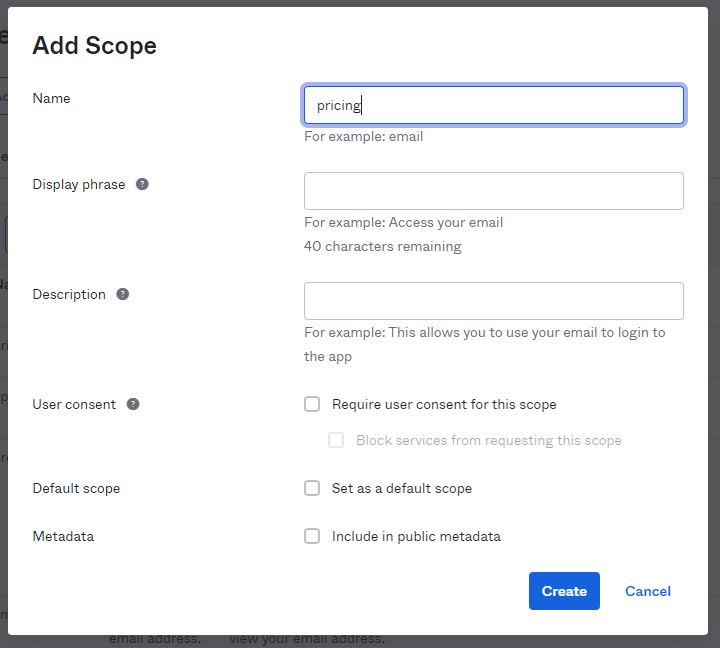
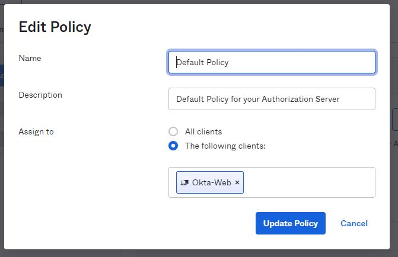

# Spring OAuth with API Gateway

## Getting Started

### Signup to Okta
Log in to your Okta Developer account (or [sign up](https://developer.okta.com/signup/) if you don’t have an account).

After login switch to Admin mode by clicking the 'Admin' button in the top navigation bar


## Configure the Okta registration
Copy the highlighted part of the URL from your browser


AND Paste into the `launch.sh` file to the highlighted place


* **IMPORTANT**: Make sure to replace in the `ISSUER_URI` AND in the **`INTROSPECT_URL`** as well. 

You will need to enable 2nd Factor authentication to access the Admin console of Okta. 
*I downloaded the Okta Verify application on my phone and connected by QR code*

### Create Stock Client Application

Setup the client application:
Navigate to the Application section in the main menu bar: 


**Create the Okta Application:**

From the **Applications** page, choose **Create App Integration**. 
- Select "OIDC - OpenID Connect"
Select **Web Application** in the Application Type section
- Name: Okta Web
- Grant type: Authorization Code, Refresh Token
- Sign-in redirect URIs: `http://localhost:8080/login/oauth2/code/okta`
- Sign-out redirect URIs: `http://localhost:8080`
- Base URIs: `http://localhost:8080/`

### Configure the clientId & clientSecret
Copy the client ID and Secret from the Application main page


Open the `lanch.sh`
Paste the `Client ID` into the `OKTA_CLIENT_ID`
Paste the `Client secret` into the `OKTA_CLIENT_SECRET`

**Create the Stock Application:**


Select **API Services** 
- Name: Stock Service ( After next )
Open the Application Main Page

Open the `launch.sh`
Paste the `Client ID` into the `EXCHANGE_CLIENT_ID`
Paste the `Client secret` into the `EXCHANGE_CLIENT_SECRET`

# Configure the Scopes
Open the `Security / API` in the left menu

Edit the `default` authorization service by clicking the edit button 


Select the `Scope` tab and add a new Scope named `pri0cing`


Now the new scope is created for the `exchange-rate` service

## Assign the application with the required scopes
Select the `Access Policies` tab
Select the the `Default Policy`
Edit the policy: 


In the popup Assign the `Okta-Web` to the Policy as below: 


Select the 2nd policy from the list on the `Access Policies` page
Edit the Policy and add the `Stock Service` to this policy in the same way as in the last step. 

Add a new Rule
Make Sure `Client Credential` is checked
In the `Scopes Requested` section select the `The following scopes`
And add the `pricing` scope explicitly here
Finally it should look like this: 


# Launch the Application Stack
Go to the root of the application and open a `Git Bash` or `Terminal` on Mac
```
./build.sh
./launch.sh
```

### This will fire up the application Stack
- Eureka: Service Registry
- API Gateway
- Stock Service
- Exchange Service
- Hystrix: Gateway circuit breaker console
- Zipkin: Distributed tracing system

# Test
Open the browser and navigate to [Greeting](http://localhost:8080/greeting)

Select to Login with `Okta Gateway Client` - the top first one
This will navigate to the Okta login. Let's login
When Oauth flow ends You will see the Id Token, Access Token, Refresh token and Session Id on the page

Copy the `session Id` and paste into the `[SESSION_ID_HERE]` placeholder below
```
curl --location --request POST 'localhost:8080/order' \
--header 'Content-Type: application/json' \
--header 'Cookie: SESSION=[SESSION_ID_HERE]' \
--data-raw '{
"symbol": "AMZN",
"amount": 15879
}'
```

If everything is good you should see the HTTP-200 and the response similar as below: 


And from PostMan
